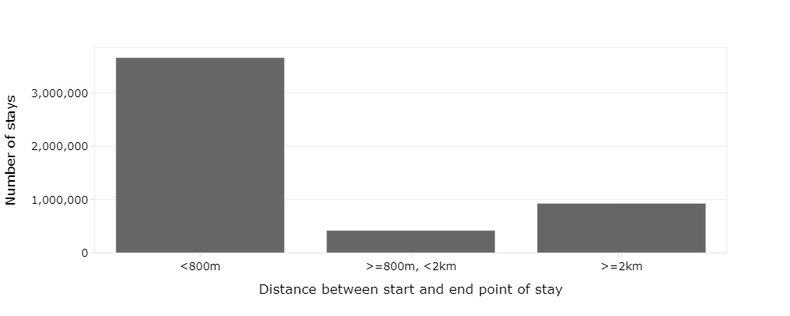

This repository supports the paper titled "Identifying individual anchoring regions by mining public transport smart card data" and contains additional supporting charts and information as an appendix to the paper.

## Using this code

Two datasets are required: journeys (containing the tag on and off transactions for a public transport network) and stops (the list of stop IDs, as used in the journeys data, and their corresponding names and coordinates).
For confidentiality reasons the original data cannot be provided. 

## Supporting charts

Since the results are not directly reproducible, throughout the code there are references to figure numbers and the plots generated from this code with the original data are included as static images here.

Figure 1: Histogram of number of card uses (with no trips dropped) - used to determine threshold for card inclusion in analysis

Figure 2: Density heatmap of activity tag on times by card type, demonstrating the prevalence of commuters and the imbalanced nature of the dataset.

Figure 3: Map demonstrating stop clustering, grouping together stops on opposite sides of the road and bus stations.

Figure 4: Categorical histogram demonstrating the distance travelled during stays, validating the use of land use to infer the region types.

Figure 5a: Fraction of time covered by anchoring region (what % of the time in the month does the passenger spend in anchoring regions?), for passengers with at least one anchoring region 

Figure 5b: Fraction of visits covered by anchoring region (what % of the visits in the month are to anchoring regions?), for passengers with at least one anchoring region 

Figure 6: Chart of AIC and BIC vs number of clusters, used to identify the number of clusters to be used

Figure 7: Map of anchoring regions by type, which permit the validation of the labelling when combined with local knowledge. Note that 'Residence' regions are not shown for clarity.
